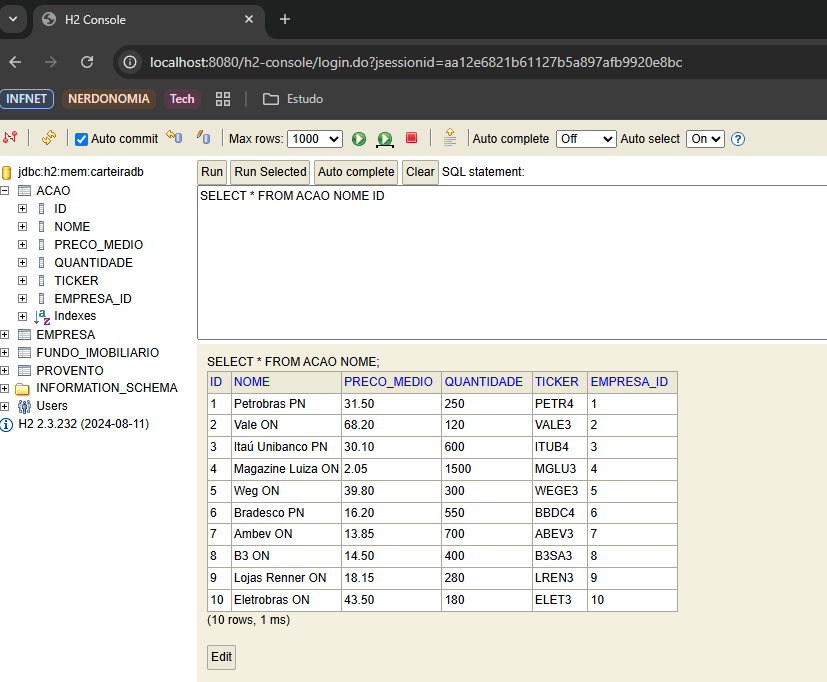
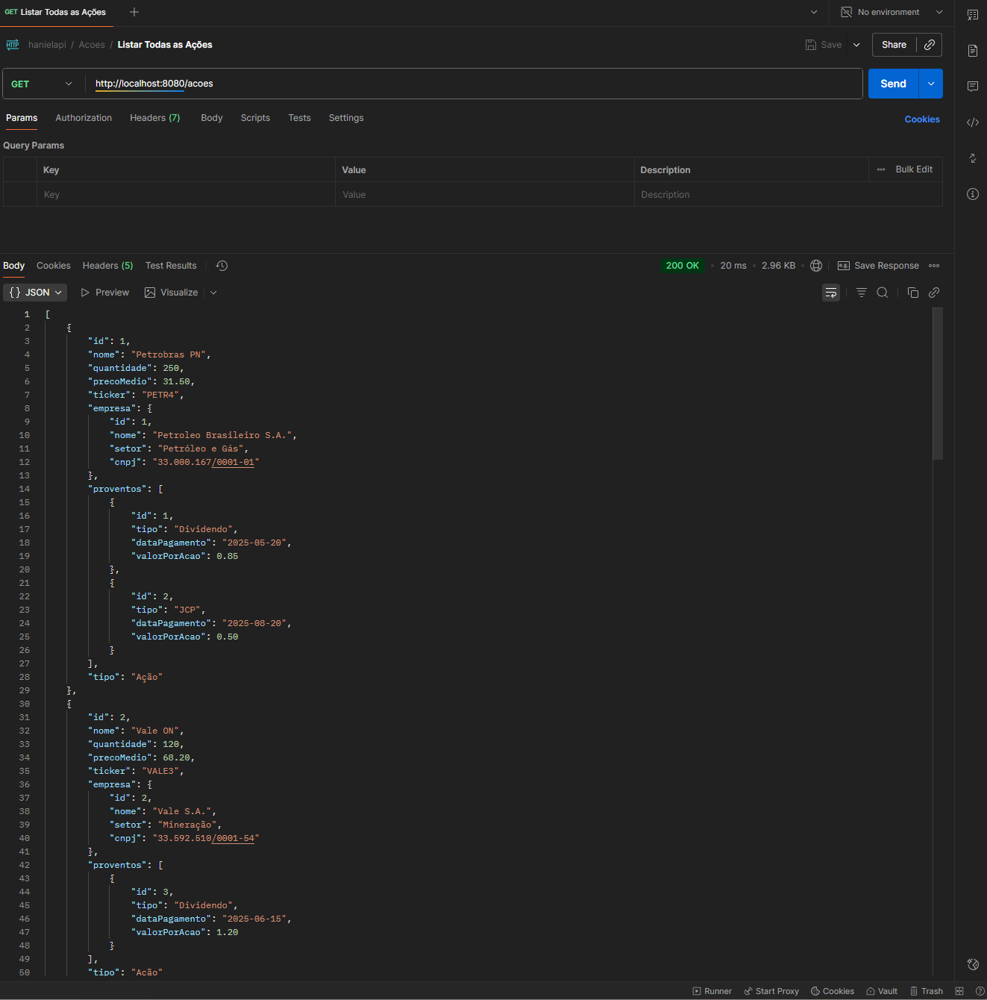
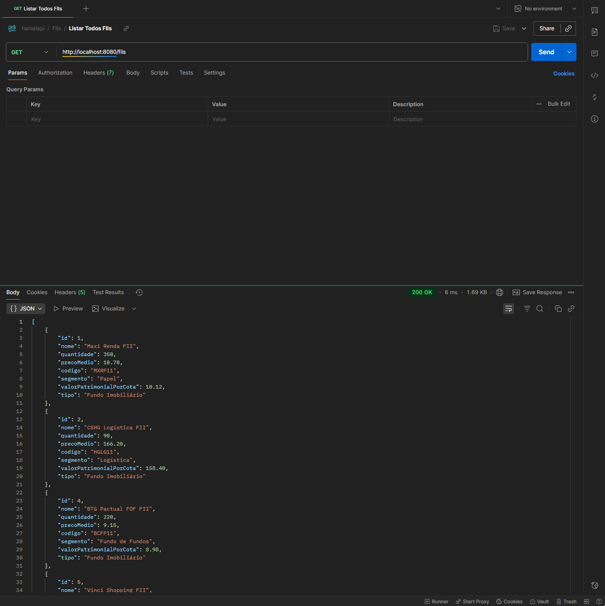
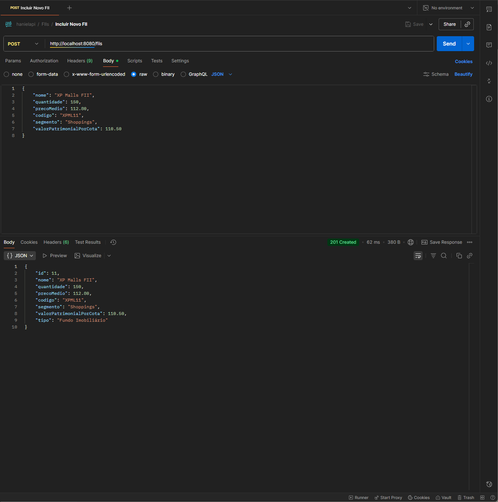
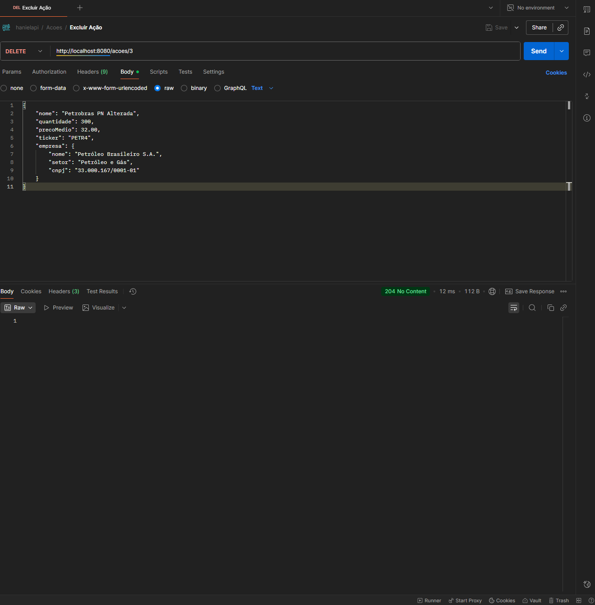
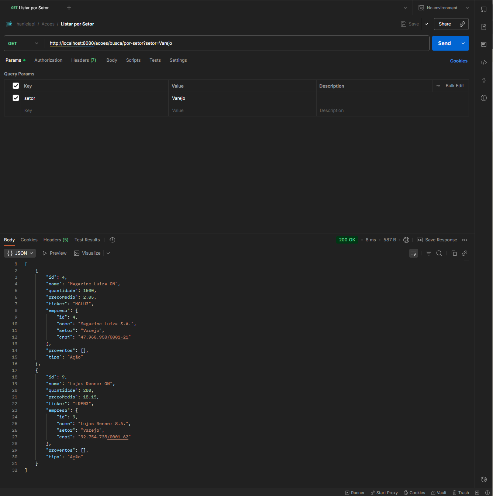

Todo o readme abaixo foi estilizado e melhorado com ajuda de IA.
# API de Gerenciamento de Carteira (hanielapi)


Este projeto é uma API RESTful robusta desenvolvida em Spring Boot, como projeto final para a disciplina de **Arquitetura Java** do **Instituto Infnet**.

A aplicação simula um sistema de back-end para o gerenciamento de uma carteira de investimentos pessoal, permitindo o cadastro, consulta, alteração e exclusão de diferentes tipos de ativos financeiros, suas empresas emissoras e seus proventos.

## 📖 Sobre o Projeto

O objetivo central é aplicar conceitos avançados de arquitetura de software para construir um serviço resiliente e bem-estruturado. O projeto foi dividido em 4 "features" que evoluíram a aplicação:

* **Feature 1:** Configuração inicial do Spring Boot e arquitetura de camadas (Controller, Service) com persistência em memória.
* **Feature 2:** Implementação de Herança (`Ativo`, `Acao`, `FII`), serviços dedicados por entidade e exceções customizadas.
* **Feature 3:** Migração da persistência de `Map` em memória para **Spring Data JPA** com um banco **H2**. Mapeamento de entidades (`@Entity`), relacionamentos (`@ManyToOne`) e refinamento da API com `ResponseEntity`.
* **Feature 4:** "Blindagem" da API com **Bean Validation** (`@Valid`), tratamento global de exceções (`@ControllerAdvice`), implementação de relacionamentos `One-to-Many` (`Acao` -> `Provento`) e uso de *Query Methods* complexos.

## 🏛️ Modelo do Domínio (Entidades)

A persistência dos dados é gerenciada pelo JPA e segue o seguinte modelo relacional:

* **`Ativo` (`@MappedSuperclass`)**: Classe-mãe abstrata que define os campos comuns como `id`, `nome`, `quantidade` e `precoMedio`. O ID é gerado pelo banco (`@GeneratedValue`).
* **`Acao` (`@Entity`)**: Entidade que herda de `Ativo`.
    * Possui um relacionamento **`@ManyToOne`** com a `Empresa` (uma ação está ligada a uma empresa).
    * Possui um relacionamento **`@OneToMany`** com `Provento` (uma ação pode ter muitos proventos).
* **`FundoImobiliario` (`@Entity`)**: Entidade que herda de `Ativo`.
* **`Empresa` (`@Entity`)**: Entidade que armazena os dados da empresa emissora (nome, setor, CNPJ).
* **`Provento` (`@Entity`)**: Entidade que armazena dividendos/JCP e possui um relacionamento **`@ManyToOne`** com `Acao`.

## 💻 Stack de Tecnologias

* **Java 21**
* **Spring Boot 3.5.6**
* **Spring Web:** Para a criação dos controllers REST.
* **Spring Data JPA:** Para a camada de persistência de dados.
* **Hibernate:** Implementação do JPA para mapeamento Objeto-Relacional (ORM).
* **H2 Database:** Banco de dados relacional em memória para desenvolvimento.
* **Spring Boot Validation:** Para validação declarativa dos DTOs e entidades.
* **Lombok:** Para reduzir o código boilerplate (getters, setters, construtores).
* **Maven:** Para gerenciamento de dependências e build do projeto.

## 🚀 Como Executar

### Pré-requisitos

* JDK 21 ou superior
* Maven 3.x

### Rodando a Aplicação

1.  Clone este repositório:
    ```bash
    git clone [https://github.com/seu-usuario/hanielapi.git](https://github.com/seu-usuario/hanielapi.git)
    cd hanielapi
    ```
2.  Execute a aplicação usando o Maven Wrapper:
    * No Linux/macOS:
        ```bash
        ./mvnw spring-boot:run
        ```
    * No Windows:
        ```bash
        mvnw.cmd spring-boot:run
        ```
3.  A API estará disponível em `http://localhost:8080`.
4.  Na inicialização, os *Loaders* (`AcaoLoader`, `FundoImobiliarioLoader`, `ProventoLoader`) irão popular o banco H2 com dados de exemplo.

## 📊 Acessando o Banco de Dados (H2 Console)

O banco de dados H2 é em memória, o que significa que os dados são recriados a cada inicialização. Você pode acessá-lo e visualizá-lo através do console web:

1.  Acesse: `http://localhost:8080/h2-console`
2.  Use as seguintes configurações (definidas em `application.properties`):
    * **JDBC URL:** `jdbc:h2:mem:carteiradb`
    * **User Name:** `sa`
    * **Password:** (deixe em branco)
3.  Clique em "Connect" para ver as tabelas (`ACAO`, `FUNDO_IMOBILIARIO`, `EMPRESA`, `PROVENTO`).

## 🗺️ Documentação da API (Endpoints)

A API está dividida em três recursos principais. Todos os endpoints tratam erros (400, 404, 500) com respostas JSON padronizadas e são validados.

Abaixo está a lista de requisições baseada na coleção Postman do projeto.

### Ações (`/acoes`)

| Método | URL | Descrição | Corpo (Body) / Parâmetros |
| :--- | :--- | :--- | :--- |
| `GET` | `/acoes` | Lista todas as Ações na carteira. | N/A |
| `GET` | `/acoes/{id}` | Busca uma Ação pelo seu ID. | N/A |
| `POST`| `/acoes` | Adiciona uma nova Ação. | `JSON` com a `Acao` (e `Empresa` aninhada). |
| `PUT` | `/acoes/{id}` | Altera uma Ação existente. | `JSON` com a `Acao` (e `Empresa` aninhada). |
| `DELETE`| `/acoes/{id}` | Exclui uma Ação pelo seu ID. | N/A |
| `PATCH` | `/acoes/{id}/desdobrar` | Realiza um split (desdobramento) na Ação. | `?fator=2` (Query Param) |
| `GET` | `/acoes/busca/por-setor` | Busca Ações pelo setor da empresa. | `?setor=Varejo` (Query Param) |

### Fundos Imobiliários (`/fiis`)

| Método | URL | Descrição | Corpo (Body) / Parâmetros |
| :--- | :--- | :--- | :--- |
| `GET` | `/fiis` | Lista todos os FIIs na carteira. | N/A |
| `GET` | `/fiis/{id}` | Busca um FII pelo seu ID. | N/A |
| `POST`| `/fiis` | Adiciona um novo FII. | `JSON` com o `FundoImobiliário`. |
| `PUT` | `/fiis/{id}` | Altera um FII existente. | `JSON` com o `FundoImobiliário`. |
| `DELETE`| `/fiis/{id}` | Exclui um FII pelo seu ID. | N/A |
| `PATCH` | `/fiis/{id}/atualizar-valor-patrimonial` | Atualiza o valor patrimonial do FII. | `JSON` `{"novoValor": 10.50}` |
| `GET` | `/fiis/busca/por-segmento-e-valor`| Busca FIIs por segmento e valor patrimonial. | `?segmento=Papel&valorMin=10.0` |

### Proventos (`/proventos`)

| Método | URL | Descrição | Corpo (Body) / Parâmetros |
| :--- | :--- | :--- | :--- |
| `GET` | `/acoes/{acaoId}/proventos` | Lista todos os Proventos de uma Ação. | N/A |
| `POST`| `/acoes/{acaoId}/proventos` | Adiciona um novo Provento a uma Ação. | `JSON` com o `Provento`. |
| `GET` | `/proventos` | Lista **todos** os Proventos de todas as ações. | N/A |
| `GET` | `/proventos/{id}` | Busca um Provento específico pelo seu ID. | N/A |
| `PUT` | `/proventos/{id}` | Altera um Provento existente. | `JSON` com o `Provento`. |
| `DELETE`| `/proventos/{id}` | Exclui um Provento pelo seu ID. | N/A |

### Prints do Postman
Visualizacao do H2<br>



Visualizacao de retornos do postman<br>





